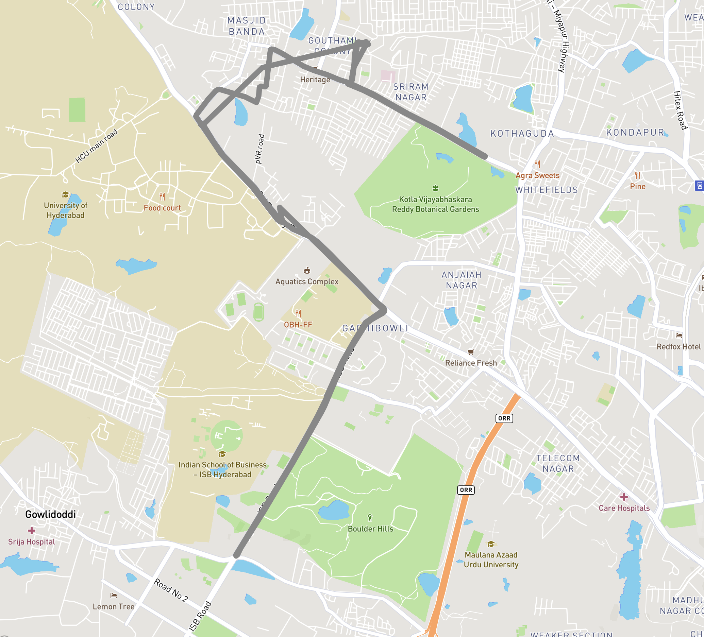

## Overview

A Geolocation based application to track movements of a particular user with the help of coordinates and visualize it over a map using MapBox apis

## Demo


<br/>
[](./DemoSnap.png)

## Steps to use

- Clone the repository
    - ```git clone https://github.com/dineshnadimpalli/GeoTracking_DriverLocation_JS.git```
- Open the ```tracking.html``` and click on start which will automatically start capturing your location using the browser geo location api
- The above step will store the coordinates in your ```localstorage``` which you need to retrieve to show on the map
- Now, open Mapbox and follow the steps to integrate ```Mapbox GL JS``` in the project and create your ```<API_KEY>``` (the project used the Mapbox cdn. There is an npm version as well)
- Open you retrieve the stored data copy paste it into ```app.js``` and also add the ```<API_KEY>``` you copied from Mapbox
- Now, open the ```index.html``` and you should see the entire track of your locations as shown in demo
- For more detailed understanding refer to the youtube video in the references below

## References

1) https://docs.mapbox.com/mapbox-gl-js/example/geojson-line/
2) https://www.youtube.com/watch?v=4SkIpVRyn_w&t=922s